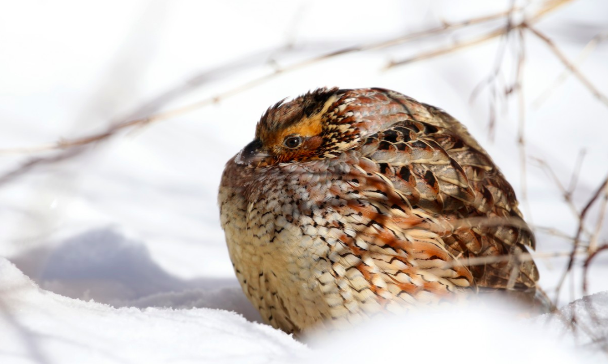
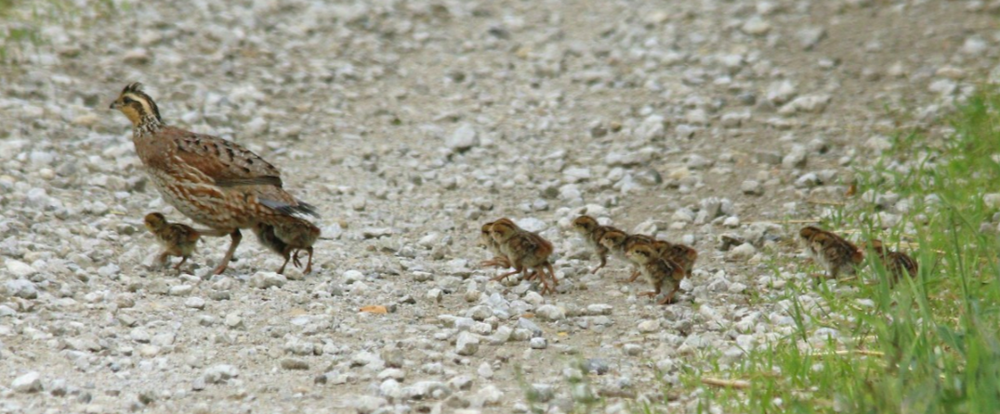
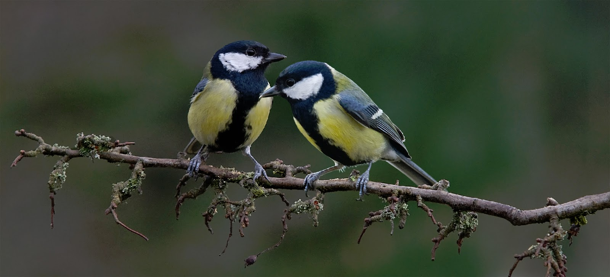
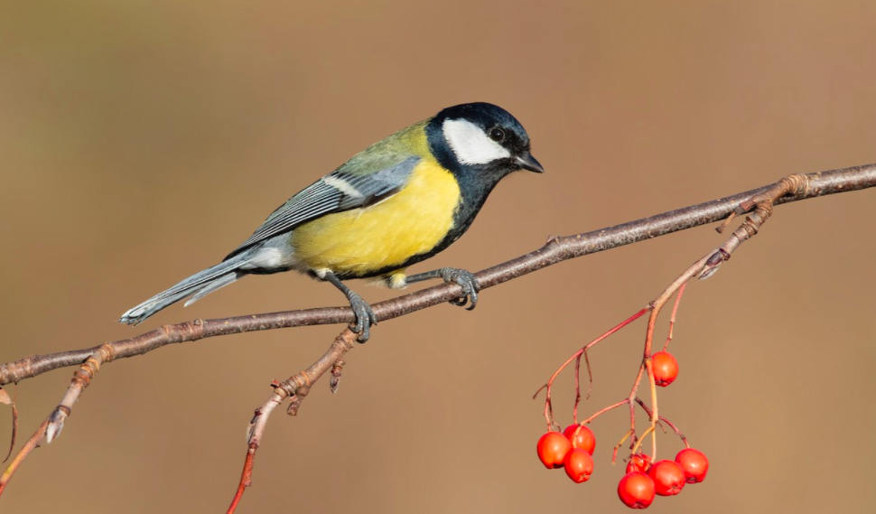

<body style="background-color:#5271b0"> 
  
## <span style="color:white; font size:40px">Mixed-Effects Models</span>
  
<center><span style="color:white; font-size:25px">Repeated Measures Model</span></center>
  
```{r setup2, include=FALSE}
knitr::opts_chunk$set(echo = TRUE)
packages_needed <- c("ggplot2", # graphics
                     "dplyr",
                     "arm", # display() etc.
                     "MASS",
                     "ggfortify",
                     "nlme",
                     "lme4",
                     "lmerTest",
                     "asbio"
                     )
pk_to_install <- packages_needed [!( packages_needed %in% rownames(installed.packages())  )]
if(length(pk_to_install)>0 ){
  install.packages(pk_to_install,repos="http://cran.r-project.org")
}
#lapply(packages_needed, require, character.only = TRUE)
library(ggplot2)
library(dplyr)
library(arm)
library(MASS)
library(ggfortify)
library(nlme)
library(lme4)
library(lmerTest)
library(tidyverse)
library(emmeans)
library(performance)
library(RColorBrewer)
``` 
    
      
<center><span style="color:white; font size:10px">Dataset: Mohlman, Jessica L. et al. (2019), Data from: Nonconsumptive effects of hunting on a nontarget game bird, Dryad [Dataset](https://doi.org/10.5061/dryad.b3k21db)</span></center>
    
<center>{width=90%}</center>
    
<span style="color:white; font size:10px">Disturbance through human hunting activity can significantly impact prey species through both consumptive and nonconsumptive effects. The nonconsumptive effects of rabbit hunting on Northern Bobwhite (*Colinus virginianus*; hereafter, bobwhite) could cause an increased perceived risk of predation by bobwhite during rabbit hunting events may elicit anti-predator responses, such as reduced movement away from the safety of cover, among bobwhite. </span>
  
  
<center>{width=100%}</center>
  
```{r, fig.align="center"}
bobwhite <- read.csv('bobwhite3.csv')
bobwhite$ID <- as.factor(bobwhite$ID) #make ID a factor
p1<- ggplot(bobwhite, aes(x=HuntDay, y=HW_Dist, group=ID, color=ID, shape=ID)) + 
  geom_point(size=4, alpha=0.6, position = position_dodge2(width=.33, preserve = "total")) +
  scale_y_continuous() +
  #geom_line() +
  geom_smooth(method = "lm", se = FALSE) +
  labs(title="Risk Behavior in Bobwhite During Hunting Season", x= "Hunting Season Species", y = "Distance from Hardwood Forest Cover (meters)")+ 
  theme_bw()+
  scale_color_brewer(palette = "BrBG")
p1
# ID: Unique ID given to each bobwhite covey tracked in chronological order.
# HuntDay: Denotes if it was a “Rabbit” or “Quail” (bobwhite) scheduled hunt day. 
# HW_Dist: Distance in meters a bobwhite covey was from hardwood habitat.
```
```{r, fig.align="center"}
bobwhite_means <- bobwhite %>%
  group_by(HuntDay) %>%
  summarise(mean_HW_Dist=mean(HW_Dist),
            se_HW_Dist=sd(HW_Dist)/sqrt(n()))
bobwhite_means
```
```{r}
mixed_bobwhite <- lmer(HW_Dist~(HuntDay*ID)+(1|ID), data = bobwhite)
anova(mixed_bobwhite) 
```
```{r, include=FALSE}
library(see)
library(patchwork)
```
```{r fig.height=9, fig.align="center"}
performance::check_model(mixed_bobwhite)
```
```{r}
bob_means <- emmeans(mixed_bobwhite, "HuntDay")
bob_means
```

Because there is an unequal number of points per day for each individual, we can check the accuracy of this model by using emmeans:
```{r}
em_bob <- as.data.frame(bob_means)
em_bob
```

```{r}
bobwhite_means
```

```{r, fig.align="center"}
em_bob$HuntDay <- factor(em_bob$HuntDay, levels= c("Quail","Rabbit"))

ggplot(em_bob, aes(x=HuntDay, y=emmean)) + 
  geom_point(size=5, color="#CCFFCC") +
  geom_errorbar(aes(ymin=emmean-SE, ymax=emmean+SE), width=.2, color="#6699CC") +
  geom_point(size=5, data=bobwhite_means, x=bobwhite_means$HuntDay, y=bobwhite_means$mean_HW_Dist, color = "#336699") +
  theme(axis.text.x = ggtext::element_markdown(color = "tan4", size = 12)) +
  scale_x_discrete(labels = labels) +
  theme(plot.caption=element_text(size=9, hjust=0, margin=margin(15,0,0,0)))+
  theme_bw()+
  labs(title="Comparing raw means to emmeans", subtitle="Light blue: raw means, Dark blue: adjusted means", x= "Hunting Day (1=Quail, 2=Rabbit)", y = "Average distance from hardwood cover (m)") 
```
  $~$
    $~$
    
  
<center><span style="color:white; font-size:25px">Nested Hierarchical Model</span>
  
<center><span style="color:white; font size:10px">Dataset: Snijders, Lysanne; van Oers, Kees; Naguib, Marc (2017), Data from: Sex-specific responses to territorial intrusions in a communication network: evidence from radio-tagged great tits, Dryad [Dataset](https://doi.org/10.5061/dryad.00v20)</span></center>
  
{width=100%}
  
</center>
  
<span style="color:white; font size:10px">Advertisement signaling is usually linked to intersexual selection and intrasexual competition and thus is a key component of a species’ ecology. Using a novel spatial tracking system, the authors tested whether or not the spatial behavior of male and female great tits (*Parus major*) changes in relation to the response of a territorial male neighbor to an intruder. They tracked the spatial behavior of male and female great tits (N = 20), 1 hr before and 1 hr after simulating territory intrusions. </span>
  
```{r, fig.align="center"}
tit <- read.csv("great_tits.csv")
tit$sex <- as.factor(tit$sex)
ggplot(tit, aes(sex, dist_m, colour = as.factor(id), shape=as.factor(measure))) + 
  geom_jitter(width =0.15, size=5, alpha=0.6)+
  ylab ("Response Distance from Playback Location (meters)") +
  xlab ("Sex") +
  annotate("text", x = 2, y = 76, label = "20 birds") +
  annotate("text", x = 2, y = 72, label = "2 measurements per bird") +
  annotate("text", x = 2, y = 67, label = "40 total measurements", size=4, color="blue")+
  labs(title="Sex-specific Responses to Territorial Intrusions", caption="1 = female
       2 = male")+
  scale_shape_discrete(name= "Measurements 
  Before / After")+
  theme_bw()
```
  
<span style="color:white; font size:10px">In this study, 20 individuals were measured 2 times, 1 hour before playback and 1 hour after. The individuals are separated by sex to look at the different distances between females and males. Distance on the Y axis is measured in meters, with distance being how many meters away a bird was detected before and after a playback recording was played of a territorial male's song.
Based on the measurements of distance before and after playback, it looks like there isn't really a pattern of whether or not sex plays a role in an individual bird's movement after a territorial playback.</span>
  
```{r, message=FALSE, warning=FALSE}
lmmtit <- lmer(dist_m ~ sex + (1|sex/id), data = tit)
summary(lmmtit)
```
```{r}
anova(lm(dist_m ~ sex/id, data = tit))

```


<center>{width=100%}</center>
$~$

</body>